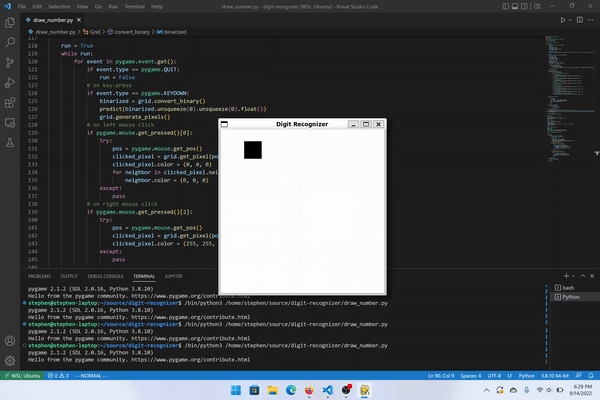

# Digit Recognizer

### Neural Network

The neural network is trained on a binarized version of the classic MNIST
dataset and has 4 layers: an input layer with 784 neurons, two hidden layers of 128 neurons each, and an output layer with 10 neurons.

The output of the neural net is then converted into probabilities for each class with a log softmax function.

### Number Guesser

The neural net can be put to the test by drawing a number on the screen and having the neural net take a guess with a keyboard press of any key.

